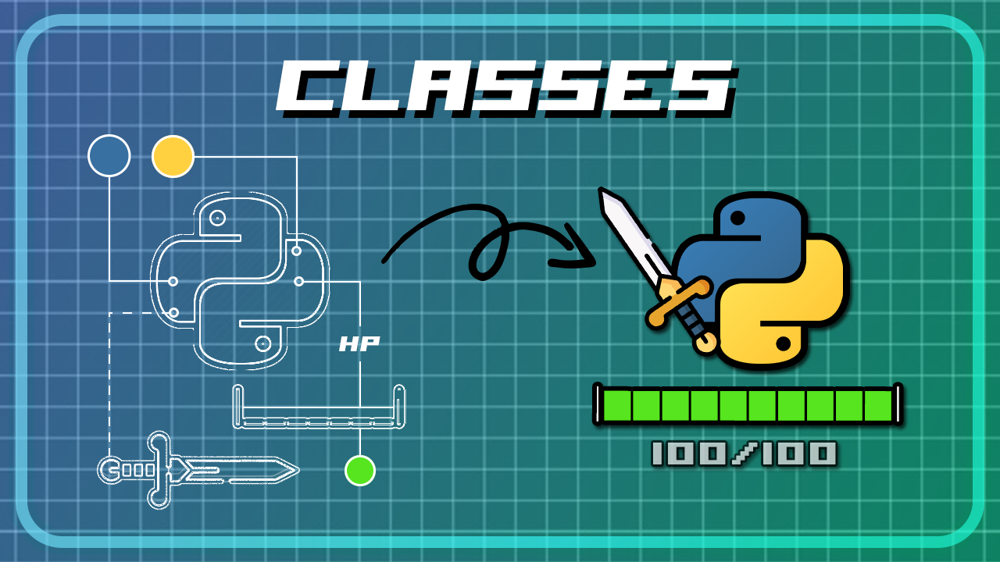

Python Classes - Text-Based Battle Scene
===========================
My most recent and well-built tutorial about Object-Oriented Programming (OOP) in Python. All in a fun way of creating a text-based ASCII battle scene, featuring Character subclasses, different Weapons and dynamic HealthBars.

https://youtu.be/0e2DexQlDYk

